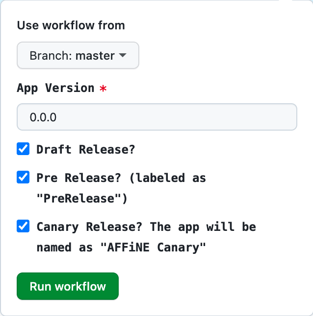

## AFFiNE Release Process

> In order to make a stable/beta release, you need to get authorization from the AFFiNE test team.

## Who Can Make a Release?

The AFFiNE core team grants release authorization and enforces the following requirements:

- Commit access to the AFFiNE repository.
- Access to GitHub Actions.

## How to Make a Release

Before releasing, ensure you have the latest version of the `canary` branch and review the [SemVer](https://semver.org) specification to understand versioning.

### 1. Update the Version in `package.json`

```shell
./scripts/set-version.sh 0.5.4-canary.5
```

### 2. Commit Changes and Push to `canary`

```shell
git add .
# vX.Y.Z-canary.N
git commit -m "v0.5.4-canary.5"
git push origin canary
```

### 3. Create a Release Action

Trigger a release action in the [Release Desktop App](https://github.com/toeverything/AFFiNE/actions/workflows/release-desktop-app.yml).



Select the appropriate branch, complete the form, and click `Run workflow`.

### 4. Publish the Release

Once the release action is complete, a draft release will appear on the [Releases page](https://github.com/toeverything/AFFiNE/releases).

Edit the release notes if necessary, then publish the release.

Ensure that:

- The release tag and title match the version in `package.json`.
- The release targets the commit you just pushed.
